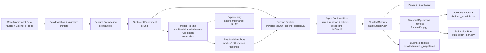

# System Architecture

This project implements an end-to-end healthcare no-show intelligence workflow with prediction, decision support, scheduling optimization, and operations UI.

## Architecture Diagram (Mermaid)

## Component Summary
- `src/data`: schema contracts, ingestion, cleaning, validation
- `src/features`: engineered behavioral + operational predictors
- `src/models`: model comparison, imbalance handling, calibration, threshold tuning
- `src/agent`: risk banding, recommendation logic, scheduling decisions
- `src/pipelines`: prepare, train, score, and insight generation orchestration
- `frontend`: role-aware operations interface
- `dashboard`: Power BI model, DAX, and storytelling specification
